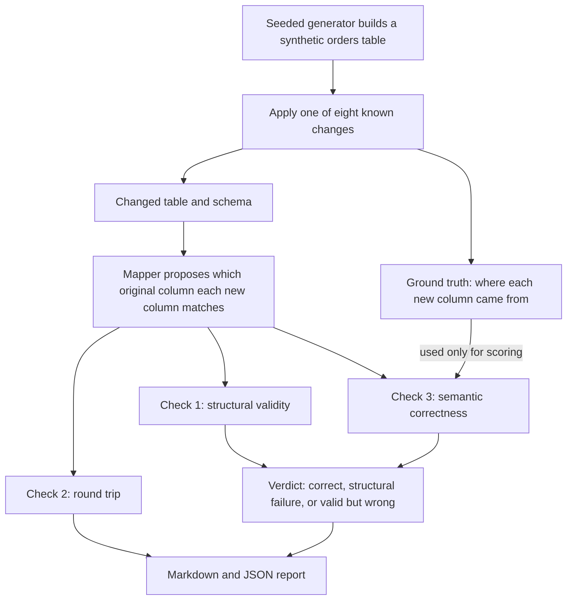

# SCHEMAMORPH bench

**A reproducible schema-drift benchmark.** A seeded generator makes a source table change in eight explicit ways, keeps the ground truth of how each target column was derived, and a harness scores mappers on three different things: does the mapping apply, does it round-trip, and does it put the right meaning in each column.

  [](https://github.com/gandhiashutosh14/schemamorph-bench/actions/workflows/ci.yml) 

---

> **In plain English:** When a data supplier renames a column or switches from cents to whole currency units, a pipeline can keep running while it loads the wrong numbers. This repository is a small, reproducible test bed: it makes such changes with a known correct answer and scores *mappers*, the tools that match old columns to new ones. It is a benchmark on synthetic data with two simple baseline mappers, not a repair tool.
>
> **Reading guide:** business readers can read the next three sections, then jump to [SWOT](#swot-analysis) and [where this applies](#where-this-applies). Engineers can go straight to [The problem, and what is implemented](#the-problem-and-what-is-implemented).

## The problem in plain English

*Illustrative example:* a finance team loads a daily orders file from a partner. One day the partner starts sending order totals in whole currency units instead of cents, or mixes up two money columns. Nothing crashes. The load reports success, and the revenue report quietly shows the wrong figures.

A **schema** is the list of a table's columns, with their names and types. When a source's schema changes, which is called **schema drift**, someone has to decide which new column feeds which old one. That decision is a **mapping**. Many checks only ask whether a mapping runs. Some also check the **round trip**: convert the data to the other layout and back, and confirm that nothing changed. Neither check proves that the numbers mean the right thing.

A travel adapter is a useful picture. It makes a plug fit a foreign socket, but it does not change the voltage. A mapping can "fit" in the same way and still deliver wrong values. The `swap` case in this repository shows it: two money columns exchange their values but keep their names. A mapping that matches by name runs cleanly and passes the round trip, yet loads each money value into the wrong field ([`reports/benchmark.md`](reports/benchmark.md)).

<p align="center"></p>
<p align="center"><sub>Image: <a href="https://commons.wikimedia.org/wiki/File:Reisestecker.jpg">Reisestecker</a> by Mattes, public domain, via Wikimedia Commons.</sub></p>

That is why this benchmark scores three things separately: does the mapping apply (**structural validity**), is it self-consistent (**round trip**), and does each column carry the right meaning (**semantic correctness**)?

## Executive summary

| Question | Answer |
|---|---|
| What problem does this address? | Source schema changes that break data integrations silently, so that a pipeline keeps running but delivers wrong values. |
| Who has this problem? | Data engineers, analytics and finance teams, and integration and platform teams, in any organisation that loads data from partners, vendors or internal systems it does not control. |
| What does this repository do? | It generates a synthetic orders table, applies eight known changes with a recorded correct answer, and scores mappers separately on structural validity, round trip and semantic correctness. |
| What has been shown so far? | 16 runs (eight changes × two baseline mappers): 8 correct, 1 structural failure and 7 structurally valid but semantically wrong ([`reports/benchmark.md`](reports/benchmark.md)). In the `swap` case, both mappers pass the round trip and are still wrong. There are 8 automated tests ([`tests/test_bench.py`](tests/test_bench.py)). |
| How mature is it? | A benchmark artifact, version 0.1.0a1 ([`pyproject.toml`](pyproject.toml)): one synthetic table, eight transformations and two deterministic baselines. |
| What it is not | Not a matcher, a drift detector or a repair tool, and it has no confidence calibration. It says nothing about how any real mapper performs on real schemas. |
| What it would take to use it for real | More change types, such as split and merge columns, encoding changes and nested JSON (JavaScript Object Notation) records; real matchers plugged in, including model-based ones; confidence scores; and fixtures built from real schema histories. |

## How it works, end to end



1. **Build a base table.** `generate_base` in [`schemamorph_bench/generator.py`](schemamorph_bench/generator.py) creates a seeded synthetic orders table: order id, customer email, order total and shipping cost in cents, currency, date, status, item count and region.
2. **Change it in a known way.** There are eight transformations: rename, drop a column, change a type, change units, round away the cents, reorder, swap two money columns, and a compound of several. For every column of the changed table, each transformation records the original column it came from, how it was converted and whether information was lost.
3. **Ask a mapper for a mapping.** A mapper sees both schemas and a sample of 20 rows of the changed table, never the ground truth ([`schemamorph_bench/harness.py`](schemamorph_bench/harness.py)). It returns `{target column: source column or None}`. The two baselines in [`schemamorph_bench/mappers.py`](schemamorph_bench/mappers.py) are `static` (exact names only) and `name_baseline` (normalised names, a short synonym list, unit suffixes and a type check).
4. **Check structure.** The harness checks that the named columns exist, that values convert strictly to the base types (`"3"` becomes `3`, but `2489.77` does not become an integer), and that the mapping applies to every row.
5. **Check the round trip.** Where a round trip is defined, sampled rows are converted to the base layout and back, and must come out unchanged (`put(get(t)) == t`). Otherwise the report says "not defined" and why: the case is lossy, the mapping is not one-to-one, or the types differ.
6. **Check meaning.** Each column assignment is compared with the ground truth, and each mapped value with the original value. The verdict depends on structure and meaning; the round trip is reported beside it.
7. **Report.** `schemamorph-bench run` writes one verdict per mapper and case to Markdown and JSON ([`schemamorph_bench/cli.py`](schemamorph_bench/cli.py)).

**Worked example.** One synthetic order in the committed run has a true order total of 248977 cents. This is what the name-based mapper does with that order in three cases ([`reports/benchmark.md`](reports/benchmark.md)):

| Case | What the changed source sends | What `name_baseline` does | Verdict |
|---|---|---|---|
| `unit_change` | the total as `2489.77` units | finds the right column, but `2489.77` cannot become integer cents, so the mapping never applies | structural failure |
| `lossy_rounding` | the total rounded to `2490` units | finds the right column and loads `2490` where the true value is `248977` | structurally valid, semantically wrong |
| `swap` | `499`, a shipping value, in the order-total column | matches by name and loads `499` as the order total; the round trip still passes | structurally valid, semantically wrong |

The `static` mapper fails in a different way: it cannot see renamed columns, so it leaves them unmapped (see [Result summary](#result-summary)).

## The problem, and what is implemented

Every integration breaks the day the other side renames a column, changes a type, or moves from cents to units. The dangerous failures are not the ones that throw: they are the mappings that still apply, still round-trip, and quietly carry the wrong meaning. This repository is the test bed for that distinction, not a mapper.

Implemented:

- **Generator** (`schemamorph_bench/generator.py`): a synthetic orders table (seeded) and eight transformations, each producing a target schema, target rows and a ground-truth derivation per target column (source column, conversion, lossy or not): `rename`, `drop_column`, `type_change`, `unit_change` (cents to units, exact at two decimals), `lossy_rounding` (whole units, cents gone), `reorder`, `swap` (two compatible money columns exchange values but keep their names), `compound`.
- **Two deterministic mappers** (`mappers.py`): `static` (the base mapping applied blindly by column name) and `name_baseline` (normalised names, a short synonym list, unit suffixes, a type-compatibility check). Neither sees the ground truth; neither converts units.
- **Harness** (`harness.py`): per mapper and case, *structural validity* (columns exist, values coerce, the mapping applies to every row), *round trip* (`put(get(t)) == t` on sampled rows where the mapping is a bijection and the case is not lossy; otherwise "not defined" with the reason), and *semantic correctness* at column level (assignment equals the derivation) and value level (mapped values equal the base values).

**Status: benchmark artifact.** There is no learned matcher, no confidence calibration, no drift detector and no automatic repair here; those are the things this benchmark exists to test, and they are listed as unimplemented rather than implied.

## Result summary

`schemamorph-bench run --rows 200 --seed 7` ([`reports/benchmark.md`](reports/benchmark.md), revision stamped in the file):

| Case | static | name_baseline |
|---|---|---|
| rename | semantically wrong (three targets unmapped) | correct |
| drop_column | correct (region reported lost) | correct |
| type_change | correct | correct |
| unit_change | semantically wrong (money targets unmapped) | **structural failure**: right columns, fractional units cannot become integer cents |
| lossy_rounding | semantically wrong (target unmapped) | **structurally valid, semantically wrong**: right column, every value off by the rounding and the scale |
| reorder | correct | correct |
| swap | **round trip ok, semantics wrong** | **round trip ok, semantics wrong** |
| compound | semantically wrong | correct |

16 runs: 8 correct, 1 structural failure, 7 structurally valid but semantically wrong. The `swap` row is the reason the harness scores three things instead of one: both mappers apply cleanly and satisfy `put(get(t)) == t` on every row, and both put each money column's meaning in the other column. A round-trip law is a self-consistency check on a mapping, not evidence that the mapping is right; the ground-truth fixtures are what tell the two apart.

## Quickstart

```bash
git clone https://github.com/gandhiashutosh14/schemamorph-bench.git
cd schemamorph-bench
python -m venv .venv && .venv\Scripts\activate      # macOS/Linux: source .venv/bin/activate
pip install -e ".[dev]"
pytest -q                                            # 8 tests, no network, no model
schemamorph-bench run --rows 200 --seed 7 --out reports/benchmark.md --json reports/benchmark.json
```

To score your own mapper, implement `map(base_schema, target_schema, sample_rows) -> {target column: source column or None}` and pass it to `harness.run`; the tests show the call.

## Boundaries and assumptions

- Round trips are checked only where they are defined: the mapping is a bijection between mapped columns, the case is not lossy, and types agree. A type change makes the round trip "not defined" because `put()` would need a conversion the mapping does not carry; a lossy case has no round trip because the information no longer exists. The report says which applies.
- Coercion is strict: `"3"` becomes `3`, `2489.77` does not become an integer. A mapper that finds the right column but cannot make the values fit is reported as a structural failure with a correct column assignment, not as a success.
- The ground truth is metadata about how the target was made. Nothing in the harness infers it from the data, and no mapper sees it.
- One synthetic table, eight transformations, two baselines. Nothing here says how any real mapper performs on real schemas.

## Prior work this sits next to

Schema-matching benchmarks and matchers (Valentine, and the LLM-era matchers built on it), the bidirectional-lens literature (Foster et al.) for the round-trip laws, and data-contract and data-observability tools for the structural checks. This repository contributes fixtures and a scoring split, not a new matcher, and claims no novelty.

## Roadmap

None of it promised: more transformations (split and merge columns, encoding changes, nested JSON), a matcher that reports a confidence so the harness can score calibration honestly against these fixtures, and a drift detector scored on time-to-detect across successive transformations.

## Project layout

```
schemamorph_bench/generator.py   base table, eight transformations, ground truth
schemamorph_bench/mappers.py     static and name-baseline mappers
schemamorph_bench/harness.py     structural, round-trip and semantic scoring
schemamorph_bench/cli.py         run -> Markdown and JSON report
tests/test_bench.py              generator determinism, every transformation's truth, the swap counterexample, the lossy flag, CLI
reports/                         the committed run with the revision that produced it
docs/DEVELOPMENT_NOTES.md        how this was built, including what the tests caught
```

## SWOT analysis

A SWOT analysis lists **S**trengths and **W**eaknesses (inside the project) and
**O**pportunities and **T**hreats (outside it).

| | Helpful | Harmful |
|---|---|---|
| **Internal** | **Strengths**<br>• Scores structure, round trip and meaning separately, so a mapping that runs and round-trips can still fail<br>• Ground truth is recorded when each change is made, and mappers never see it<br>• Seeded and deterministic, with 8 tests ([`tests/test_bench.py`](tests/test_bench.py)) and a committed report ([`reports/benchmark.md`](reports/benchmark.md))<br>• Reports "not defined", with a reason, instead of a false round-trip pass<br>• Any mapper with the `map(base_schema, target_schema, sample_rows)` shape can be scored | **Weaknesses**<br>• One synthetic table and eight transformations; no real schemas or schema histories<br>• Only two deterministic baselines; no learned or model-based matcher is scored yet<br>• No confidence calibration, drift detection or automatic repair<br>• Neither baseline converts units, so both fail the unit-change and rounding cases<br>• Small scale: 200 rows in the committed run, and no load testing |
| **External** | **Opportunities**<br>• New matchers built on large language models (LLMs), such as Magneto and ReMatch, need tests that check meaning<br>• Data contracts and schema-registry compatibility rules check structure, which leaves room for a semantic check<br>• More change types, such as split and merge columns, encodings and nested JSON (on the [roadmap](#roadmap))<br>• Scoring confidence calibration and drift detectors' time-to-detect (also on the roadmap) | **Threats**<br>• Established schema-matching benchmarks, such as Valentine, already serve as reference points for matcher evaluation<br>• Data-quality and data-observability tools may add similar semantic checks<br>• Synthetic fixtures may not reflect how real schemas change, which limits how far the results carry over<br>• Compatibility rules in schema registries can block some drift before it reaches a pipeline |

The weaknesses repeat limits that the project states itself in [Boundaries and assumptions](#boundaries-and-assumptions).

## Where this applies

These are example settings for the approach, not deployments. The repository itself uses only synthetic data.

| Industry | Example use case | What this project's approach contributes |
|---|---|---|
| Finance and accounting | A payment provider's export changes a money column from cents to units | The unit and rounding cases show how a mapping can load wrong amounts, with or without an error |
| Retail and e-commerce | A marketplace partner renames its order columns | The rename and compound cases test whether a mapper keeps each field's meaning |
| Healthcare data exchange | A laboratory system changes the units of a measurement | The three-way score separates "loads fine" from "means the right thing" |
| Banking and insurance data warehouses | A core-system upgrade reorders or retypes columns | Structural, round-trip and semantic scores show which failures are loud and which are silent |
| Supply chain and logistics | A carrier feed swaps two similar numeric fields | The `swap` case is a ready-made test that name matching cannot pass and a round-trip check cannot detect |
| Software-as-a-service (SaaS) data integration | A connector vendor tests its mappers before a release | A plug-in harness and ground-truth fixtures that can score any mapper |
| Data platform teams | Deciding whether a proposed schema change is safe to release | A semantic check to sit beside data contracts and compatibility rules |
| Model-assisted data mapping | Evaluating a model that proposes column matches | Ground truth lets a team score the model's suggestions on meaning, not only on names |

## Glossary

Short definitions of the terms this README uses most.

| Term | Plain-English meaning |
|---|---|
| Schema | The list of a table's columns, with their names and types. |
| Schema drift | A change to a data source's schema over time, such as a renamed or retyped column. |
| Mapping | A statement of which original column each column of the changed table corresponds to. |
| Mapper | Code that proposes a mapping by looking at both schemas and some sample rows. |
| Baseline | A deliberately simple method that more advanced methods should beat. |
| Ground truth | The recorded correct answer for how each changed column was made, used only for scoring. |
| Structural validity | The mapping names real columns, its values convert to the right types, and it applies to every row. |
| Round trip | Converting data to the other layout and back; a pass means nothing changed (`put(get(t)) == t`). |
| Lens | A pair of functions, `get` and `put`, that move data between two layouts and obey round-trip laws. |
| Bijection | A one-to-one pairing, where every mapped target column has its own distinct source column. |
| Semantic correctness | Each column carries the meaning it should, and its values match the original values. |
| Lossy | A change that throws information away, such as rounding off cents, so the original cannot be rebuilt. |
| Coercion | Converting a value to another type, such as the text `"3"` to the number `3`. |
| Seed | A number that fixes the random generator, so that every run produces the same data. |

## Further reading

Schema-matching research comes first, then the round-trip theory, then the tools that teams use today.

| Resource | What it is | Why it matters here |
|---|---|---|
| [Valentine: Evaluating Matching Techniques for Dataset Discovery](https://arxiv.org/abs/2010.07386) — Koutras et al., IEEE International Conference on Data Engineering (ICDE), 2021 | A benchmark and experiment suite for schema-matching methods | The benchmark that the README names as its closest prior work |
| [Magneto: Combining Small and Large Language Models for Schema Matching](https://arxiv.org/abs/2412.08194) — Liu et al., 2024 | A schema matcher that pairs small and large language models | An example of the model-based matchers this harness is meant to score |
| [ReMatch: Retrieval Enhanced Schema Matching with LLMs](https://arxiv.org/abs/2403.01567) — Sheetrit et al., 2024 | A schema matcher that combines retrieval with large language models | Another model-based matcher whose output could be checked for meaning here |
| [A survey of approaches to automatic schema matching](https://doi.org/10.1007/s007780100057) — Erhard Rahm and Philip A. Bernstein, The VLDB Journal, 2001 | A survey and taxonomy of schema-matching methods | Background for the name- and type-based techniques in `name_baseline` |
| [Combinators for bidirectional tree transformations: A linguistic approach to the view-update problem](https://www.cis.upenn.edu/~bcpierce/papers/lenses-toplas-final.pdf) — J. Nathan Foster, Michael B. Greenwald, Jonathan T. Moore, Benjamin C. Pierce and Alan Schmitt, ACM Transactions on Programming Languages and Systems, 2007 | The paper that defines lenses and their round-trip laws | The source of the `put(get(t)) == t` check that the harness uses |
| [Model contracts](https://docs.getdbt.com/docs/mesh/govern/model-contracts) — dbt Labs, dbt Developer Hub, current documentation | How dbt enforces each column's name and data type for a model | A common way for teams to catch structural drift; this benchmark adds a semantic check |
| [Great Expectations documentation](https://docs.greatexpectations.io/docs/home/) — Great Expectations, current documentation | Documentation for GX Core, a Python library for testing data against declared expectations | Value-level tests like these can catch some wrong values that a mapping lets through |
| [Schema Evolution and Compatibility for Schema Registry on Confluent Platform](https://docs.confluent.io/platform/current/schema-registry/fundamentals/schema-evolution.html) — Confluent, current documentation | Explains backward, forward and full compatibility rules for evolving schemas | Compatibility rules check structure; the `swap` case shows why meaning needs its own check |

## License

MIT. See [LICENSE](LICENSE).
